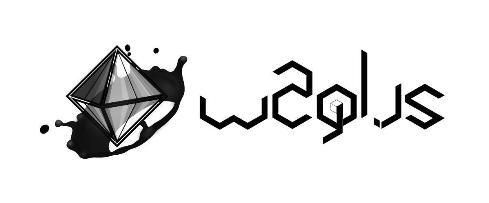

# w2gl.js [![NPM Package][npm]][npm-url] [![Build Size][build-size]][build-size-url] [![NPM Downloads][npm-downloads]][npmtrends-url] [![Dev Dependencies][dev-dependencies]][dev-dependencies-url]

> *javascript micro-library based on [three.js](https://threejs.org) that will helping you initialize your shader scene more quickly*

[english](README.md) - [french](documentation/documentation.readme.fr.md)

## Problem❓

*to make a film, a director needs 3 things: a scene, a camera and a monitor. it's exactly the same in the world of shaders. But implementing webgl natively is not an easy task. then it's really not easy to keep the code clean with this api. fortunately, new libraries have already solved this problem. thanks to them! Even though it has become easier to create webgl shaders with these libraries, sur still has to redefine the same instructions before we can have fun with our shaders.*

### three.js

```html
<!-- source @see https://thebookofshaders.com/04/ -->
<body>
  <div id="container"></div>
  <script src="js/three.min.js"></script>
  <script id="vertexShader" type="x-shader/x-vertex">
    void main () {
      gl_Position = vec4( position, 1.0 );
    }
  </script>
  <script id="fragmentShader" type="x-shader/x-fragment">
    uniform vec2 u_resolution;
    uniform float u_time;

    void main () {
      vec2 st = gl_FragCoord.xy/u_resolution.xy;
      gl_FragColor=vec4( st.x, st.y, 0.0, 1.0 );
    }
  </script>
  <script>
    var container;
    var camera, scene, renderer;
    var uniforms;

    init();
    animate();

    function init() {
      container = document.getElementById( 'container' );

      camera = new THREE.Camera();
      camera.position.z = 1;

      scene = new THREE.Scene();

      var geometry = new THREE.PlaneBufferGeometry( 2, 2 );

      uniforms = {
          u_time: { type: "f", value: 1.0 },
          u_resolution: { type: "v2", value: new THREE.Vector2() },
          u_mouse: { type: "v2", value: new THREE.Vector2() }
      };

      var material = new THREE.ShaderMaterial( {
          uniforms: uniforms,
          vertexShader: document.getElementById( 'vertexShader' ).textContent,
          fragmentShader: document.getElementById( 'fragmentShader' ).textContent
      } );

      var mesh = new THREE.Mesh( geometry, material );
      scene.add( mesh );

      renderer = new THREE.WebGLRenderer();
      renderer.setPixelRatio( window.devicePixelRatio );

      container.appendChild( renderer.domElement );

      onWindowResize();
      window.addEventListener( 'resize', onWindowResize, false );

      document.onmousemove = function(e){
        uniforms.u_mouse.value.x = e.pageX
        uniforms.u_mouse.value.y = e.pageY
      }
    }

    function onWindowResize( event ) {
      renderer.setSize( window.innerWidth, window.innerHeight );
      uniforms.u_resolution.value.x = renderer.domElement.width;
      uniforms.u_resolution.value.y = renderer.domElement.height;
    }

    function animate() {
      requestAnimationFrame( animate );
      render();
    }

    function render() {
      uniforms.u_time.value += 0.05;
      renderer.render( scene, camera );
    }
```

### Solution❓

*and if you stop implementing the same instructions to start a project every time. as a 3d developer, you are going to need assistance, you need a safe guy who will take care of your back, who will take care of the boring tasks that you don't want to repeat anymore. this guy may be **w2gl**. written in javascript this micro-library based on 3d engine libraries will allow you to have fun quickly with the obscure universe of shaders. note that **w2gl** is not there to replace the role of these libraries, it is a little overlay on these libraries which will precisely prepare your 3d scene and give you some super powers through a `starter` object.*

### w2gl.js

```js
const starter = w2gl.init( {
  THREE,
  shader: {
    myShaderName : {
      vertex: `
        void main () {
          gl_Position = vec4(position, 1.0);
        }
      `,
      fragment: `
        uniform vec2 resolution;
        uniform float time;

        void main () {
          vec2 st = gl_FragCoord.xy / resolution.xy;
          gl_FragColor=vec4(st.x, st.y, 0.0, 1.0);
        }
      `
    }
  }
} );

starter.events.onresize( starter.screen.resize );
starter.events.onmousemove( starter.mouse.move );
```

## ⚠️ Disclaimer

i'm not a developer, i'm just a normal guy who likes programming with the desire to learn more about the dark side of force. last points, changes will be coming in the future for the good of all, i hope.

## 📦 Install dependencies

### Command line

```sh
npm i w2gl
```

OR

```sh
yarn add w2gl
```

### Download

you can also download the project, after recover the file in `dist/w2gl.js` and then add it in the folder of your project in which you store the external libraries to your development.

## 🚀 Start project

are you looking to create a scene quickly? If your answer is yes, you should try this!

### 1. es6

```js
import * as THREE from 'three';
import w2gl from 'w2gl';
import vertex from './shader/vertex.fs';
import fragment from './shader/fragment.fs';

// 1. first way, to obtain the starter object provided by the result of the init method
const starter = w2gl.init( { THREE, shader: { myShaderName : { vertex, fragment } } } );

console.log( starter ); // <-- et hop! w2gl is available

// 2. second way, to obtain the starter object provided by the callback function, pass as the second argument of the init method
w2gl.init( { THREE, shader: { myShaderName : { vertex, fragment } } }, starter => {

  console.log( starter ); // <-- voilà! w2gl is ready in the callback scope only

} );
```

### 2. html/javascript

```html
<script src="./src/three.js"></script>
<script src="./src/w2gl.js"></script>

<script id="vertexShader" type="x-shader/x-vertex">
  void main () {
    gl_Position = vec4( position, 1.0 );
  }
</script>

<script id="fragmentShader" type="x-shader/x-fragment">
  uniform vec2 resolution;
  uniform float time;

  void main () {
    vec2 st = gl_FragCoord.xy/resolution.xy;
    gl_FragColor=vec4( st.x, st.y, 0.0, 1.0 );
  }
</script>

<script>
  // 1. first way, to obtain the starter object provided by the result of the init method
  var starter = w2gl.init( {
    THREE,
    shader: {
      vertex: document.getElementById( 'vertexShader' ).innerHTML,
      fragment: document.getElementById( 'fragmentShader' ).innerHTML
    }
  } );

  console.log( starter ); // <-- et hop! w2gl is available

  // 2. second way, to obtain the starter object provided by the callback function, pass as the second argument of the init method
  w2gl.init( {
    THREE,
    shader: {
      vertex: document.getElementById( 'vertexShader' ).innerHTML,
      fragment: document.getElementById( 'fragmentShader' ).innerHTML
    } 
  }, starter => {
  
    console.log( starter ); // <-- voilà! w2gl is available and scoped
  
  } );
</script>
```

## 📖 API

- ### `.init( option )`

  the `init` method takes as an input argument: `option`.

  ##### params

  `option` **{ Object }**: collection.

  ##### example

  [see the option schema](./documentation/documentation.option.md)

- ### `starter`

  it's a collection of methods that will help you during the development of your shaders. It contains everything you need to focus on your main task.

  ##### example

  ```js
  {
    THREE: {ACESFilmicToneMapping: 5, AddEquation: 100, AddOperation: 2, AdditiveBlending: 2, AlphaFormat: 1021, …}
    shader: {myShaderName: S}
    scene: {current: ob}
    camera: {current: db}
    renderer: {current: og}
    events: {onmousemove: ƒ, onresize: ƒ, clear: ƒ, init: ƒ, mousemove: ƒ, …}
    mouse: X {x: 5, y: 382, move: ƒ}
    screen: ea {width: 1306, height: 460, resize: ƒ}
  }
  ```

  - #### `.shader`

    the `shader` object returns `THREE.Mesh` created from `PlaneBufferGeometry` and `ShaderMaterial`. This is the one that contains your vertex shader and your shader fragment as well as the uniforms.

    ##### uniforms

    to save time, I have already implemented basic uniforms.   

    ##### example

    ```glsl
    // fragmentShader.fs || vertexShader.vs

    uniform vec2 mouse;
    uniform vec2 resolution;
    uniform float time;
    ```

    ```js
    // index.js
    starter.shader.myShaderName.material.uniforms

    /* output:

    {
      mouse: {type: "v2", value: new THREE.Vector2()}
      resolution: {type: "v2", value: new THREE.Vector2()}
      time: {type: "f", value: 0.0}
    }

    */
    ```

  - #### `.scene`

    the scene object returns `THREE.Scene()`. This scene is the 3d space in which your mesh will be.

  - #### `.camera`

    the scene object returns `THREE.Camera()`. A basic camera without artifice that you don't need to initialize.

  - #### `.renderer`

    the scene object returns `THREE.WebGLRenderer()`. I have it a little custom at once, so that it can increment the value of `timer.time` within the rendering loop.

  - #### `.events`

    i have made available to you methods that you can use as event listeners to update your scene. indeed each of these methods are executed in the event listener corresponding to its name.

    - #### `onmousemove( f )`

      this method is called when the mouse is moving on the screen. You can retrieve the `window` object directly and then update your fragment shader only when a movement of the mouse is detected.

      ##### arguments

      `f` **{ Function }**: callback.
      `returns` **{ Void }**: undefined.

      ##### explanation

      `onmousemove` => execute in the event listener callback `window.addEventListener( 'mousemove', _ => {}, false );`   

      ##### example

      ```js
      starter.shader.myShaderName.onmousemove( event => {

        starter.shader.myShaderName.material.uniforms.mouse.value.x = event.clientX;
        starter.shader.myShaderName.material.uniforms.mouse.value.y = event.clientY;

      } );
      ```

    - #### `onrender( f )`

      this method is executed in a `requestAnimationFrame`. `onrender` is called with as input argument a `timer` object which will allow you to update your shader fragment.

      ##### arguments

      `f` **{ Function }**: callback.
      `returns` **{ Void }**: undefined.

      ##### explanation

      `onrender` => executed in the `setAnimationLoop` method. 

      ##### example

      ```js
      starter.shader.myShaderName.onrender( timer => {

        starter.shader.myShaderName.material.uniforms.time.value += timer.time;

      } );
      ```

    - #### `onresize( f )`

      this method is called when the dimensions of your screens have changed, an event argument is passed to it that you can use to update the resolution of your fragment shader only when a screen change has been detected.

      ##### arguments

      `f` **{ Function }**: callback.
      `returns` **{ Void }**: undefined.

      ##### explanation

      `onresize` => execute in the event listener callback `window.addEventListener( 'resize', _ => {}, false );`  

      ##### example

      ```js
      starter.renderer.current.onresize( event => {

        starter.renderer.current.setSize( event.target.innerWidth, event.target.innerHeight );

      } );
      ```

  - #### `.mouse`

    contains `new Mouse ()` which is nothing more than a simple two-dimensional vector. so you don't need to implement it anymore. It is accessible via the `starter` object. once initialized. You will have access to its positions `x`, `y`.

    ##### example

    ```js
    starter.mouse

    // output {x: 0, y: 0, move: ƒ}

    starter.events.onmousemove( starter.mouse.move );

    // the mouse is initialized to update each time the onmousemove event is called.
    ```

  - #### `.screen`

    it is the screen component, it contains the screen dimension and a resize function that you can call to though the `starter.events.onresize`.

    ##### example

    ```js
    starter.screen

    // output {width: 343, height: 811, resize: ƒ}

    starter.events.onresize( starter.screen.resize ); 

    // the screen is initialized to be set each time the onresize event is called.
    ```

## 🚨 Tests

### Running

**reports**

```sh
npm run test:reports
```

OR

```sh
yarn test:reports
```

**watch**

```sh
npm run test:watch
```

OR

```sh
yarn test:watch
```

## 📝 Todo

- [ ] supports glsl #include
- [ ] more events
- [ ] documentation
- [x] mode by default
- [ ] improve test cases

## 📁 Source

- [WebGL best practices](https://developer.mozilla.org/en-US/docs/Web/API/WebGL_API/WebGL_best_practices)
- [three.js documentation](https://threejs.org/docs/index.html)

## ©️ License

Copyright ©️ 2019 monsieurbadia

Released under the [MIT](https://github.com/monsieurbadia/glsl-reports/blob/master/LICENSE.md) license

## 🙏 Supports

logo by [@mllemartins](https://twitter.com/mllemartins) with 🖤   
built by [@monsieurbadia](https://twitter.com/monsieurbadia) with 🖤    

*⭐️ this repository if this project helped you!*       

[npm]: https://img.shields.io/npm/v/w2gl
[npm-url]: https://www.npmjs.com/package/w2gl
[build-size]: https://badgen.net/bundlephobia/minzip/w2gl
[build-size-url]: https://bundlephobia.com/result?p=w2gl
[npm-downloads]: https://img.shields.io/npm/dw/w2gl
[npmtrends-url]: https://www.npmtrends.com/w2gl
[dev-dependencies]: https://img.shields.io/david/dev/monsieurbadia/w2gl.js
[dev-dependencies-url]: https://david-dm.org/monsieurbadia/w2gl.js#info=devDependencies
