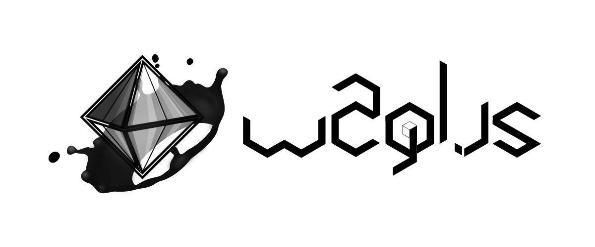

# w2gl.js [![NPM Package][npm]][npm-url] [![Build Size][build-size]][build-size-url] [![NPM Downloads][npm-downloads]][npmtrends-url] [![Dev Dependencies][dev-dependencies]][dev-dependencies-url]

> *a **WebGL** micro-library based on [three.js](https://threejs.org) that will helping you initialize your shader scene more quickly.*

## Problem❓

*to create a scene a director cut need 3 things : a scene, a camera and a monitor. it's the same in the shader universe. but using the **webgl api** natively is not easy to use or to maintain a clean code. Some libraries already resolve this issue. thank god ! even if now it's more simple to create a shaders in **WebGL.** we still have to create declare several instructions manually before playing with shaders. it can be annoying when like me you like to play with the **webgl** technology.*

### three.js

```html
<!-- source @see https://thebookofshaders.com/04/ -->
<body>
  <div id="container"></div>
  <script src="js/three.min.js"></script>
  <script id="vertexShader" type="x-shader/x-vertex">
    void main () {
      gl_Position = vec4( position, 1.0 );
    }
  </script>
  <script id="fragmentShader" type="x-shader/x-fragment">
    uniform vec2 u_resolution;
    uniform float u_time;

    void main () {
      vec2 st = gl_FragCoord.xy/u_resolution.xy;
      gl_FragColor=vec4( st.x, st.y, 0.0, 1.0 );
    }
  </script>
  <script>
    var container;
    var camera, scene, renderer;
    var uniforms;

    init();
    animate();

    function init() {
      container = document.getElementById( 'container' );

      camera = new THREE.Camera();
      camera.position.z = 1;

      scene = new THREE.Scene();

      var geometry = new THREE.PlaneBufferGeometry( 2, 2 );

      uniforms = {
          u_time: { type: "f", value: 1.0 },
          u_resolution: { type: "v2", value: new THREE.Vector2() },
          u_mouse: { type: "v2", value: new THREE.Vector2() }
      };

      var material = new THREE.ShaderMaterial( {
          uniforms: uniforms,
          vertexShader: document.getElementById( 'vertexShader' ).textContent,
          fragmentShader: document.getElementById( 'fragmentShader' ).textContent
      } );

      var mesh = new THREE.Mesh( geometry, material );
      scene.add( mesh );

      renderer = new THREE.WebGLRenderer();
      renderer.setPixelRatio( window.devicePixelRatio );

      container.appendChild( renderer.domElement );

      onWindowResize();
      window.addEventListener( 'resize', onWindowResize, false );

      document.onmousemove = function(e){
        uniforms.u_mouse.value.x = e.pageX
        uniforms.u_mouse.value.y = e.pageY
      }
    }

    function onWindowResize( event ) {
      renderer.setSize( window.innerWidth, window.innerHeight );
      uniforms.u_resolution.value.x = renderer.domElement.width;
      uniforms.u_resolution.value.y = renderer.domElement.height;
    }

    function animate() {
      requestAnimationFrame( animate );
      render();
    }

    function render() {
      uniforms.u_time.value += 0.05;
      renderer.render( scene, camera );
    }
```

### Solution❓

*As a director cut you need some assistance, in fact you need this guy who gets your back all the time, it will do the annoying tasks for you. you know what i mean! but more seriously, **w2gl** is a javascript micro-layer based on the 3D engine libraries which will allow you to quickly to have fun quickly with the obscure universe of shaders. **w2gl** do not replace the perfect role that the 3D engine libraries allow, it just there to prepare a scene for you.*

### w2gl.js

```js
const starter = w2gl.init( {
  THREE,
  shader: {
    myShaderName : {
      vertex: `
        void main () {
          gl_Position = vec4(position, 1.0);
        }
      `,
      fragment: `
        uniform vec2 resolution;
        uniform float time;

        void main () {
          vec2 st = gl_FragCoord.xy / resolution.xy;
          gl_FragColor=vec4(st.x, st.y, 0.0, 1.0);
        }
      `
    }
  }
} );

starter.events.onresize( starter.screen.resize );
starter.events.onmousemove( starter.mouse.move );
```

## ⚠️ Disclaimer

i am not a developer, i am just a regular guy whos appreciate programming and want to learn more about shader. So in a future some changes will be expected.

## 📦 Install dependencies

### 1. npm

```sh
npm i w2gl
```

### 2. yarn

```sh
yarn add w2gl
```

## 🚀 Start project

Are you wanted to initialize your scene quickly? try this!

### 1. es6

```js
import * as THREE from 'three';
import w2gl from 'w2gl';
import vertex from './shader/vertex.fs';
import fragment from './shader/fragment.fs';

// 1. first way, get the starter object provide by the init function result
const starter = w2gl.init( { THREE, shader: { myShaderName : { vertex, fragment } } } );

console.log( starter ); // <-- et hop! w2gl is set in the starter constant

// 2. second way, get the starter object provide by the init callback function
w2gl.init( { THREE, shader: { myShaderName : { vertex, fragment } } }, starter => {

  console.log( starter ); // <-- voilà! w2gl is ready in the callback scope only

} );
```

### 2. html/javascript

```html
<script src="./src/three.js"></script>
<script src="./src/w2gl.js"></script>

<script id="vertexShader" type="x-shader/x-vertex">
  void main () {
    gl_Position = vec4( position, 1.0 );
  }
</script>

<script id="fragmentShader" type="x-shader/x-fragment">
  uniform vec2 resolution;
  uniform float time;

  void main () {
    vec2 st = gl_FragCoord.xy/resolution.xy;
    gl_FragColor=vec4( st.x, st.y, 0.0, 1.0 );
  }
</script>

<script>
  // 1. first way, get the starter object from the init return function
  var starter = w2gl.init( {
    THREE,
    shader: {
      vertex: document.getElementById( 'vertexShader' ),
      fragment: document.getElementById( 'fragmentShader' )
    }
  } );

  console.log( starter ); // w2gl is set in the starter constant

  // 2. second way, get the starter object from the init callback
  w2gl.init( {
    THREE,
    shader: {
      vertex: document.getElementById( 'vertexShader' ),
      fragment: document.getElementById( 'fragmentShader' )
    } 
  }, starter => {
  
    console.log( starter ); // w2gl is ready in the callback scope only
  
  } );
</script>
```

## 📖 API

- ### `.init( option )`

  the `init` function takes option param.

  ##### params

  `option` **{ Object }**: collection.

  ##### example

  [see the option schema](./documentation/w2gl.option.md)

- ### `starter` [ Object ]

  it is a collection that we help you during your shader development.

  ##### example

  ```js
  {
    THREE: {ACESFilmicToneMapping: 5, AddEquation: 100, AddOperation: 2, AdditiveBlending: 2, AlphaFormat: 1021, …}
    shader: {myShaderName: S}
    scene: {current: ob}
    camera: {current: db}
    renderer: {current: og}
    events: {onmousemove: ƒ, onresize: ƒ, clear: ƒ, init: ƒ, mousemove: ƒ, …}
    mouse: X {x: 5, y: 382, move: ƒ}
    screen: ea {width: 1306, height: 460, resize: ƒ}
  }
  ```

  - #### `.shader` [ THREE.Mesh ]

    it is a plane buffer geometry with a shader material that contains your both shaders.

    ##### uniforms

    several uniforms are already implemented for you.   

    <br/>

    ```js
    starter.shader.myShaderName.material.uniforms

    /* output:

    {
      mouse: {type: "v2", value: t}
      resolution: {type: "v2", value: t}
      time: {type: "f", value: 1}
    }

    */
    ```

  - #### `.scene` [ THREE.Scene ]

    it is your THREE scene that is already initliazed.

  - #### `.camera` [ THREE.Camera ]

    it is your THREE camera that is already initialized.

  - #### `.renderer` [ THREE.WeGLRenderer ]

    it is your THREE renderer that is already initialized.

  - #### `.events` [ Object ]

    use the events listener to update your scene, for example each shader and render got to himself several listeners.

    - #### `onrender`

      this method is run during a requestAnimationFrame that will give you a timer object that you can used to update your fragment shader.

      ##### example

      ```js
      starter.shader.myShaderName.onrender( timer => {

        starter.shader.myShaderName.material.uniforms.time.value += timer.time;

      } );
      ```

    - #### `onresize`

      this method is called when the screen dimension has been changed. You can get the event and used it to resize you fragment shader only when the screen size has been detected.

      ##### example

      ```js
      starter.renderer.myShaderName.onresize( event => {

        starter.renderer.myShaderName.setSize( event.target.innerWidth, event.target.innerHeight );

      } );
      ```

    - #### `onmousemove`

      this method is called when the mouse is moving the entire screen. You can get the `window` event and used to update you fragment shader only when a mouse move has been detected.

      ##### example

      ```js
      starter.shader.myShaderName.onmousemove( event => {

        starter.shader.myShaderName.material.uniforms.mouse.value.x = event.clientX;
        starter.shader.myShaderName.material.uniforms.mouse.value.y = event.clientY;

      } );
      ```

  - #### `.mouse`

    it is the mouse component. you not need to create your mouse class. It is accessible through the starter object.

    ##### example

    ```js
    starter.mouse

    // outuput {x: 0, y: 0, move: ƒ}

    starter.events.onmousemove( starter.mouse.move );

    // the mouse is initialized to makes update each time the onmousemove event will be called.
    ```

  - #### `.screen`

    it is the screen component, it contains the screen dimension and a resize function that you can call to though the `starter.event.onresize`.

    ##### example

    ```js
    starter.screen

    // outuput {width: 343, height: 811, resize: ƒ}

    starter.events.onresize( starter.screen.resize ); 

    // the screen is initialized to makes update each time the onresize event will be called.
    ```

## 🚨 Tests

**reports**

```sh
npm run test:reports
```

OR

```sh
yarn test:reports
```

**watch**

```sh
npm run test:watch
```

OR

```sh
yarn test:watch
```

## 📝 Todo

- [ ] supports glsl #include
- [ ] more events
- [ ] documentation
- [x] mode by default
- [ ] improve learning test cases

## 📁 Source

- [WebGL best practices](https://developer.mozilla.org/en-US/docs/Web/API/WebGL_API/WebGL_best_practices)
- [three.js documentation](https://threejs.org/docs/index.html)

## ©️ License

Copyright ©️ 2019 monsieurbadia

Released under the [MIT](https://github.com/monsieurbadia/glsl-reports/blob/master/LICENSE.md) license

## 🙏 Supports

Logo with 🖤 by [@mllemartins](https://twitter.com/mllemartins)   
Built with 🖤 by [@monsieurbadia](https://twitter.com/monsieurbadia)    

⭐️ this repository if this project helped you!       

[npm]: https://img.shields.io/npm/v/w2gl
[npm-url]: https://www.npmjs.com/package/w2gl
[build-size]: https://badgen.net/bundlephobia/minzip/w2gl
[build-size-url]: https://bundlephobia.com/result?p=w2gl
[npm-downloads]: https://img.shields.io/npm/dw/w2gl
[npmtrends-url]: https://www.npmtrends.com/w2gl
[dev-dependencies]: https://img.shields.io/david/dev/monsieurbadia/w2gl.js
[dev-dependencies-url]: https://david-dm.org/monsieurbadia/w2gl.js#info=devDependencies
